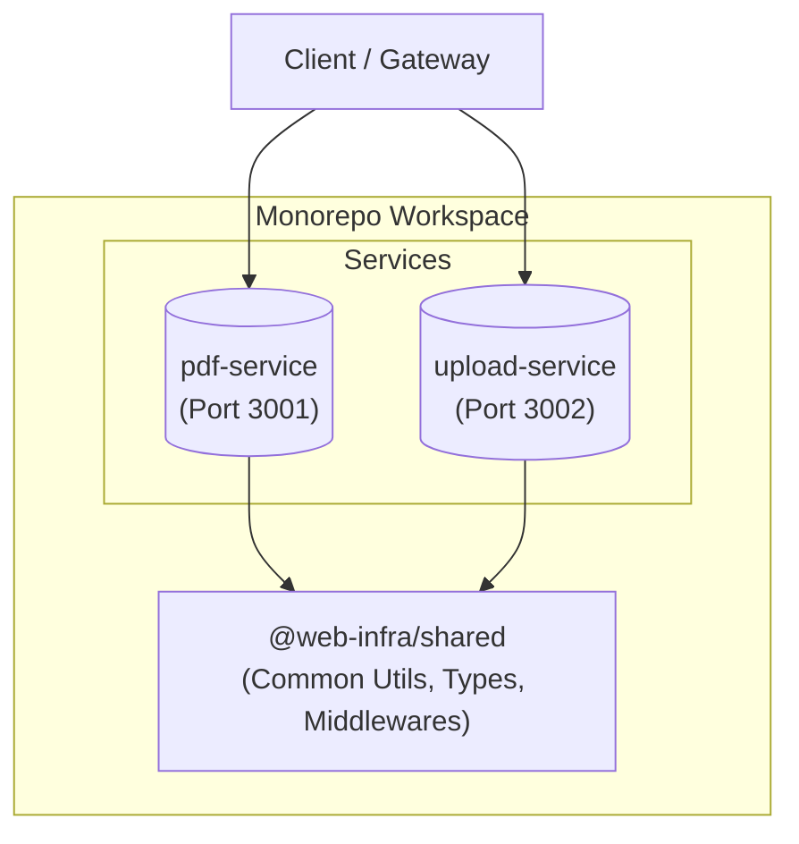

# Web Infra Services (Monorepo)


This repository hosts a robust monorepo containing two standalone microservices: **`pdf-service`** and **`upload-service`**, along with a shared library **`@web-infra/shared`**. It is designed for scalability, maintainability, and ease of development.

## Table of Contents

- [Features](#features)
- [Architecture](#architecture)
- [Directory Structure](#directory-structure)
- [Services & Ports](#services--ports)
- [Getting Started](#getting-started)
  - [Prerequisites](#prerequisites)
  - [Installation & Running](#installation--running)
  - [Docker](#docker)
- [API Documentation](#api-documentation)
  - [PDF Service](#pdf-service-port-3001)
  - [Upload Service](#upload-service-port-3002)
- [Shared Library](#shared-library-web-infrashared)
- [Environment Variables](#environment-variables)
- [Tech Stack](#tech-stack)

## Features

- **Web to PDF Conversion**: High-fidelity PDF generation using Playwright (`pdf-service`).
- **Resumable Uploads**: Chunked file uploads with resume capability and merge functionality (`upload-service`).
- **Shared Infrastructure**: Unified error handling, request context, logging, and utilities via `@web-infra/shared`.
- **Scalable Architecture**: Independent services with configurable concurrency and Docker support.
- **Modern Tooling**: Built with Node.js 20, TypeScript 5, and pnpm workspaces.

## Architecture



## Directory Structure

```
web-infra-service/
├── apps/                               # Application services
│   ├── pdf-service/                    # PDF generation service
│   │   ├── src/                        # Source code
│   │   └── Dockerfile                  # Service-specific Dockerfile
│   └── upload-service/                 # Chunked upload service
│       ├── src/                        # Source code
│       └── Dockerfile                  # Service-specific Dockerfile
├── packages/                           # Shared libraries
│   └── shared/                         # Common code
│       ├── src/                        # Source code
│       │   ├── middlewares/            # Express middlewares
│       │   ├── utils/                  # Utility functions
│       │   └── errors.ts               # Unified error handling
│       └── package.json
├── package.json                        # Workspace root configuration
├── pnpm-workspace.yaml                 # Workspace definition
└── docker-compose.yml                  # Legacy compose file
```

## Services & Ports

| Service          | Default Port | Description                               |
| :--------------- | :----------- | :---------------------------------------- |
| `pdf-service`    | `3001`       | Handles HTML/URL to PDF conversion tasks. |
| `upload-service` | `3002`       | Manages chunked file uploads and merging. |

## Getting Started

### Prerequisites

- **Node.js**: >= 20.0.0
- **pnpm**: >= 10.15.0
- **TypeScript**: >= 5.9.2

### Installation & Running

1.  **Install Dependencies**:

    ```bash
    pnpm install
    ```

    _Note: Playwright browsers will be installed automatically._

2.  **Build Shared Library**:

    ```bash
    pnpm --filter @web-infra/shared build
    ```

3.  **Start Services (Development)**:
    - **PDF Service**:
      ```bash
      pnpm dev:pdf
      ```
    - **Upload Service**:
      ```bash
      pnpm dev:upload
      ```

4.  **Build All**:
    ```bash
    pnpm -r build
    ```

### Docker

You can build and run each service independently using Docker.

#### Build Images

```bash
# PDF Service
docker build -f apps/pdf-service/Dockerfile -t pdf-service .

# Upload Service
docker build -f apps/upload-service/Dockerfile -t upload-service .
```

#### Run Containers

```bash
# PDF Service
docker run -p 3001:3001 --name pdf-service --restart unless-stopped pdf-service

# Upload Service
docker run -p 3002:3002 --name upload-service --restart unless-stopped upload-service
```

## API Documentation

### PDF Service (Port `3001`)

- **Health Check**: `GET /`
- **Generate PDF**: `POST /api/v1/pdf`

**Example Request:**

```bash
curl -X POST http://localhost:3001/api/v1/pdf \
  -H "Content-Type: application/json" \
  -d '{
    "url": "https://www.typescriptlang.org/",
    "pdfOptions": { "format": "A4", "printBackground": true }
  }' --output typescript.pdf
```

### Upload Service (Port `3002`)

- **Health Check**: `GET /`
- **Check Status**: `GET /api/v1/upload/status`
- **Upload Chunk**: `POST /api/v1/upload`
- **Merge Chunks**: `POST /api/v1/upload/merge`

**Example Flow:**

1.  **Check Status**:
    ```bash
    curl "http://localhost:3002/api/v1/upload/status?fileHash=abc123"
    ```
2.  **Upload Chunk**:
    ```bash
    curl -X POST http://localhost:3002/api/v1/upload \
      -F "file=@chunk-0.bin" \
      -F "fileHash=abc123" \
      -F "chunkIndex=0"
    ```
3.  **Merge**:
    ```bash
    curl -X POST http://localhost:3002/api/v1/upload/merge \
      -H "Content-Type: application/json" \
      -d '{ "fileHash": "abc123", "filename": "example.pdf", "totalChunks": 5 }'
    ```

## Shared Library (`@web-infra/shared`)

The shared library ensures consistency across services:

- **Errors**: Unified error hierarchy (e.g., `AppError`, `ValidationError`).
- **Middlewares**: Standard Express middlewares (`errorHandler`, `requestContext`, `asyncHandler`, `requestLogger`).
- **Types**: Shared TypeScript interfaces for API contracts.
- **Utils**: Helper functions for file handling and other common tasks.

## Environment Variables

Each service can be configured via environment variables (or `.env` files):

| Variable            | Description               | Default           |
| :------------------ | :------------------------ | :---------------- |
| `PORT`              | Service listening port    | `3001` / `3002`   |
| `PDF_CONCURRENCY`   | Max concurrent PDF jobs   | `4`               |
| `MERGE_CONCURRENCY` | Max concurrent merge jobs | `2`               |
| `UPLOAD_DIR`        | Directory for temp chunks | _(inside shared)_ |
| `MERGE_DIR`         | Directory for final files | _(inside shared)_ |

## Tech Stack

- **Runtime**: Node.js 20
- **Language**: TypeScript 5.x
- **Framework**: Express 5.1.0
- **Package Manager**: pnpm 10.15.0
- **Browser Engine**: Playwright 1.55.0 (PDF Service)
- **Utilities**: Multer, p-limit
