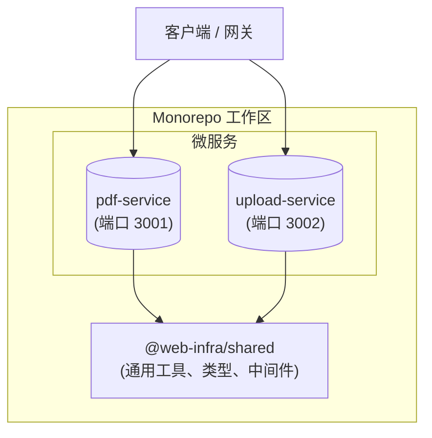

# Web 基础服务（Monorepo）


本项目托管了一个强大的 Monorepo，包含两个独立的微服务：**`pdf-service`** 和 **`upload-service`**，以及一个共享库 **`@web-infra/shared`**。项目旨在实现高扩展性、可维护性和易于开发。

## 目录

- [功能特性](#功能特性)
- [架构设计](#架构设计)
- [目录结构](#目录结构)
- [服务与端口](#服务与端口)
- [快速开始](#快速开始)
  - [环境要求](#环境要求)
  - [安装与运行](#安装与运行)
  - [Docker 部署](#docker-部署)
- [API 文档](#api-文档)
  - [PDF 服务](#pdf-服务端口-3001)
  - [上传服务](#上传服务端口-3002)
- [共享库](#共享库-web-infrashared)
- [环境变量](#环境变量)
- [技术栈](#技术栈)

## 功能特性

- **Web 转 PDF**：使用 Playwright 进行高保真 PDF 生成（`pdf-service`）。
- **断点续传**：支持分片上传、断点续传和文件合并功能（`upload-service`）。
- **共享基础设施**：通过 `@web-infra/shared` 统一错误处理、请求上下文、日志和工具函数。
- **可扩展架构**：独立服务，支持配置并发和 Docker 部署。
- **现代技术栈**：基于 Node.js 20、TypeScript 5 和 pnpm workspaces 构建。

## 架构设计



## 目录结构

```
web-infra-service/
├── apps/                               # 应用服务目录
│   ├── pdf-service/                    # PDF 生成服务
│   │   ├── src/                        # 源代码
│   │   └── Dockerfile                  # 服务专用 Dockerfile
│   └── upload-service/                 # 分片上传服务
│       ├── src/                        # 源代码
│       └── Dockerfile                  # 服务专用 Dockerfile
├── packages/                           # 共享库目录
│   └── shared/                         # 通用代码
│       ├── src/                        # 源代码
│       │   ├── middlewares/            # Express 中间件
│       │   ├── utils/                  # 工具函数
│       │   └── errors.ts               # 统一错误处理
│       └── package.json
├── package.json                        # 工作区根配置
├── pnpm-workspace.yaml                 # 工作区定义
└── docker-compose.yml                  # 旧版 compose 文件
```

## 服务与端口

| 服务             | 默认端口 | 描述                              |
| :--------------- | :------- | :-------------------------------- |
| `pdf-service`    | `3001`   | 处理 HTML/URL 到 PDF 的转换任务。 |
| `upload-service` | `3002`   | 管理分片文件上传和合并。          |

## 快速开始

### 环境要求

- **Node.js**: >= 20.0.0
- **pnpm**: >= 10.15.0
- **TypeScript**: >= 5.9.2

### 安装与运行

1.  **安装依赖**：

    ```bash
    pnpm install
    ```

    _注意：会自动安装 Playwright 浏览器。_

2.  **构建共享库**：

    ```bash
    pnpm --filter @web-infra/shared build
    ```

3.  **启动服务（开发模式）**：
    - **PDF 服务**：
      ```bash
      pnpm dev:pdf
      ```
    - **上传服务**：
      ```bash
      pnpm dev:upload
      ```

4.  **全量构建**：
    ```bash
    pnpm -r build
    ```

### Docker 部署

你可以使用 Docker 独立构建和运行每个服务。

#### 构建镜像

```bash
# PDF 服务
docker build -f apps/pdf-service/Dockerfile -t pdf-service .

# 上传服务
docker build -f apps/upload-service/Dockerfile -t upload-service .
```

#### 运行容器

```bash
# PDF 服务
docker run -p 3001:3001 --name pdf-service --restart unless-stopped pdf-service

# 上传服务
docker run -p 3002:3002 --name upload-service --restart unless-stopped upload-service
```

## API 文档

### PDF 服务（端口 `3001`）

- **健康检查**：`GET /`
- **生成 PDF**：`POST /api/v1/pdf`

**请求示例：**

```bash
curl -X POST http://localhost:3001/api/v1/pdf \
  -H "Content-Type: application/json" \
  -d '{
    "url": "https://www.typescriptlang.org/",
    "pdfOptions": { "format": "A4", "printBackground": true }
  }' --output typescript.pdf
```

### 上传服务（端口 `3002`）

- **健康检查**：`GET /`
- **检查状态**：`GET /api/v1/upload/status`
- **上传分片**：`POST /api/v1/upload`
- **合并分片**：`POST /api/v1/upload/merge`

**示例流程：**

1.  **检查状态**：
    ```bash
    curl "http://localhost:3002/api/v1/upload/status?fileHash=abc123"
    ```
2.  **上传分片**：
    ```bash
    curl -X POST http://localhost:3002/api/v1/upload \
      -F "file=@chunk-0.bin" \
      -F "fileHash=abc123" \
      -F "chunkIndex=0"
    ```
3.  **合并**：
    ```bash
    curl -X POST http://localhost:3002/api/v1/upload/merge \
      -H "Content-Type: application/json" \
      -d '{ "fileHash": "abc123", "filename": "example.pdf", "totalChunks": 5 }'
    ```

## 共享库（`@web-infra/shared`）

共享库确保了服务间的一致性：

- **Errors**：统一的错误层级（如 `AppError`, `ValidationError`）。
- **Middlewares**：标准 Express 中间件（`errorHandler`, `requestContext`, `asyncHandler`, `requestLogger`）。
- **Types**：共享的 API 契约 TypeScript 接口。
- **Utils**：文件处理和其他通用任务的辅助函数。

## 环境变量

每个服务都可以通过环境变量（或 `.env` 文件）进行配置：

| 变量                | 描述                | 默认值          |
| :------------------ | :------------------ | :-------------- |
| `PORT`              | 服务监听端口        | `3001` / `3002` |
| `PDF_CONCURRENCY`   | 最大 PDF 并发任务数 | `4`             |
| `MERGE_CONCURRENCY` | 最大合并并发任务数  | `2`             |
| `UPLOAD_DIR`        | 临时分片目录        | _(shared 内部)_ |
| `MERGE_DIR`         | 最终文件目录        | _(shared 内部)_ |

## 技术栈

- **运行时**：Node.js 20
- **语言**：TypeScript 5.x
- **框架**：Express 5.1.0
- **包管理**：pnpm 10.15.0
- **浏览器引擎**：Playwright 1.55.0 (PDF 服务)
- **工具库**：Multer, p-limit
